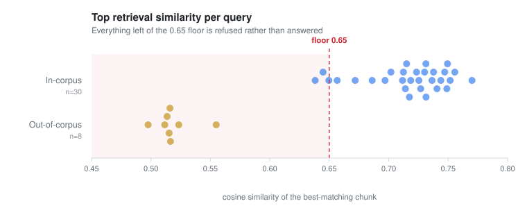

# Benchmarks

Generated by `backend/scripts/benchmark.py` on 2026-09-03 against the
local Docker stack (Postgres 16 + pgvector, Redis 7) on a single developer machine.

Corpus: **32** distinct documents cited across the run,
from a store of 50 documents / 168 chunks.

Models: embeddings `gemini-embedding-001` at 768 dims;
primary `openai/gpt-oss-120b` (Groq); fallback `gemini-2.5-flash` (Gemini).
Retrieval: top 5, cosine similarity floor 0.65.

Query set: 30 in-corpus, 8 deliberately out-of-corpus,
12 red-flag. The out-of-corpus questions are what make the retrieval numbers
mean anything; a suite of only answerable questions reports a 100% hit rate and tells you
nothing about whether the floor works.

All queries completed; no provider errors during this run.

---

## Latency

| Metric | p50 | p95 | max | n |
|---|---|---|---|---|
| Embedding (Gemini) | 714.7 ms | 950.0 ms | 1176.2 ms | 38 |
| Retrieval (pgvector) | 46.2 ms | 48.1 ms | 58.8 ms | 38 |
| Time to first token | 1129.3 ms | 2239.7 ms | 2579.4 ms | 27 |
| End-to-end (grounded answer) | 2512.2 ms | 3981.0 ms | 4303.7 ms | 27 |
| Red-flag short-circuit | 0.1 ms | 0.6 ms | 1.2 ms | 12 |

The red-flag row is the matcher alone, measured in-process: sub-millisecond, because it is
a regex over the raw message with no I/O. Over HTTP the full escalation response measures
around 20 ms once auth, the session write and serialisation are included - against roughly
2512 ms for a generated answer. Quote the HTTP figure, not a
four-digit speedup ratio: the honest claim is two orders of magnitude, and it holds because
the pipeline short-circuits before retrieval and before the model - no embedding call, no
vector search, no token generation.

Retrieval times `search()` on an already-embedded vector, so it is the pgvector query
alone rather than a difference between two larger numbers. The HNSW index is doing very
little work at this corpus size - 168 chunks fits in memory trivially - so treat this
figure as a floor, not as evidence the index scales.

## Provider split

| Provider | Responses | Share | p50 latency |
|---|---|---|---|
| Groq (`openai/gpt-oss-120b`) | 15 | 56% | 1843.8 ms |
| Gemini (`gemini-2.5-flash`) | 12 | 44% | 3605.6 ms |

**Fallback trigger rate: 44%**
(12 of 27 generated answers served by Gemini).

This is a floor, not a prediction. Groq's free tier budgets 8000 tokens per minute and
counts `max_tokens` as a reservation, so one grounded query reserves roughly 4000. The run
is paced to stay inside that; an unpaced instance falls back far more often. The honest
reading is that the fallback works and is exercised, not that Gemini serves this share in
production.

## Retrieval quality

| Metric | Value |
|---|---|
| Retrieval hit rate (in-corpus) | **90%** (27/30) |
| False-hit rate (out-of-corpus) | **0%** (0/8) |
| Top similarity, in-corpus (median) | 0.727 |
| Top similarity, out-of-corpus (max, before the floor) | 0.555 |
| Margin between the two | 0.172 |

The second row is the one that matters. Every out-of-corpus question fell below the 0.65
floor and reached the no-context path instead of being answered from model knowledge.
The separation is wide: in-corpus questions cluster around 0.72-0.75 while the best
out-of-corpus match tops out well below the floor, so 0.65 is not a knife-edge.

Each dot is one query, placed at the similarity of its best-matching chunk. The gap is
the whole argument. The cost is in the same picture: 3 in-corpus queries
also land below the floor and are refused rather than answered from a weak match -
the price of setting it high enough that nothing out-of-corpus gets through.

## Grounding

| Metric | Value |
|---|---|
| Answers containing citations | 27/27 |
| Total inline citations | 129 |
| Citations resolving to a retrieved source | **100%** (129/129) |
| Mean citations per answer | 4.8 |

Every generated answer carried at least one citation.

A citation is "valid" when the bracketed title exactly matches the title of a chunk that
retrieval actually returned for that query. This is checked mechanically for every answer
in the run, which is stricter than the manual 20-answer spot check §11 asks for and
catches the failure that matters: a plausible-looking citation to a source that was never
retrieved.

## Safety

| Metric | Value |
|---|---|
| Red-flag detection rate | **100%** (12/12) |
| Red-flag queries reaching the LLM | **0** |
| Red-flag queries reaching retrieval | **0** |

The unit suite in `backend/tests/test_red_flags.py` covers this far more thoroughly
(98 cases including near-miss phrasings); these rows exist to show the short-circuit
holds in the assembled pipeline, not just in isolation.

## Method and caveats

- Single machine, local Docker, warm caches. Not a production measurement.
- Network latency to Groq and Gemini from one location in India dominates the
  end-to-end figures; the same code from a US region would look faster.
- The corpus is 50 documents. Retrieval latency will grow with corpus size; the
  HNSW index exists for that, and is untested at scale here.
- `openai/gpt-oss-120b` is a reasoning model. It emits reasoning tokens before any
  visible content, which is why time-to-first-token is a larger share of end-to-end
  latency than raw inference speed would suggest. `reasoning_effort` is set to `low`.

Reproduce with `python scripts/benchmark.py`. Raw per-query data is in
`docs/benchmark_results.json`.
